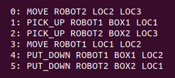
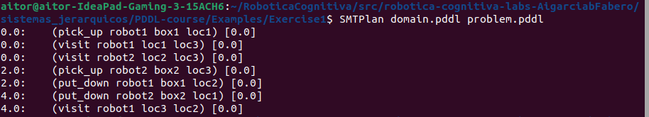
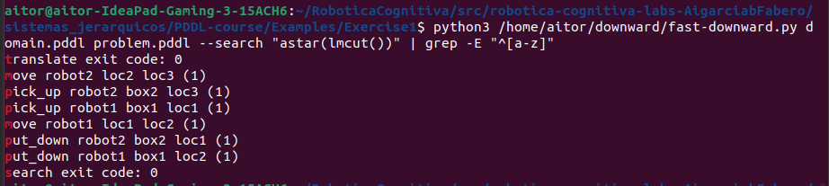
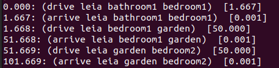
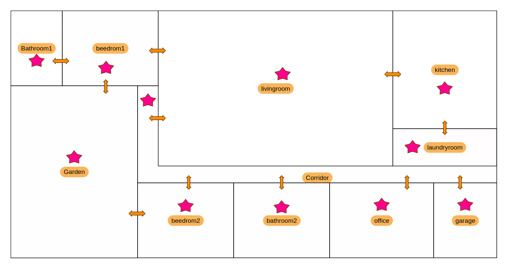
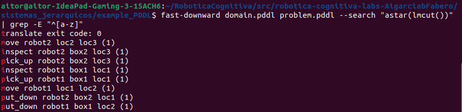
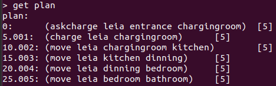
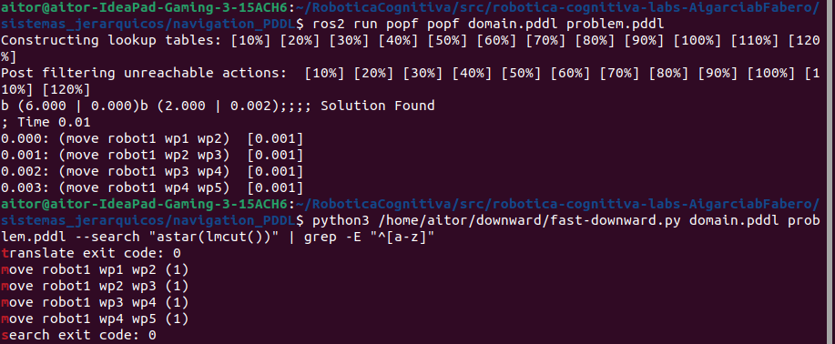
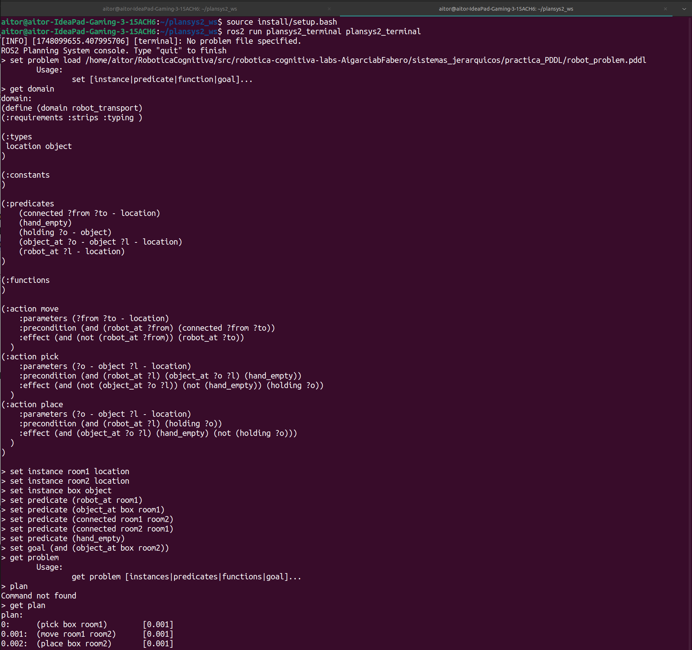
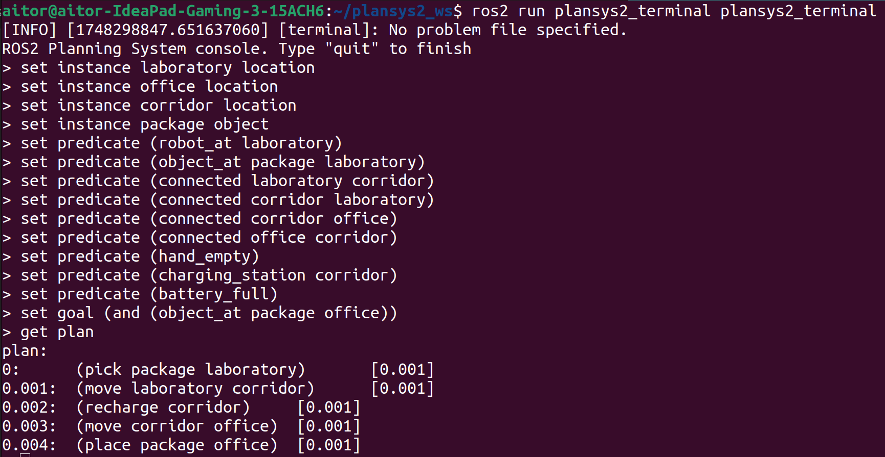

# Práctica: Sistemas jerárquicos

1. [Análisis de dominio simple](#análisis-de-dominio-simple)
   - [Prueba Exercise1](#prueba-exercise1)
   - [Prueba Exercise2](#prueba-exercise2)
   - [Revisión del dominio y problema del primer ejercicio](#revisión-y-dominio-del-primer-ejercicio)
   - [Revisión del dominio y problema del segundo ejercicio](#revisión-y-problema-del-segundo-ejercicio)
2. [Extensión del dominio](#2-extensión-del-dominio)
3. [Integración de PDDL en entorno simulado](#3-integración-de-pddl-en-entorno-simulado)
4. [Aplicación final: Navegación entre waypoints usando planificación PDDL](#4-aplicación-final-navegación-entre-waypoints-usando-planificación-pddl)
5. [Aplicación práctica: Gestión de niveles de energía en un Robot](#5-aplicación-práctica-gestión-de-niveles-de-energía-en-un-robot)

## 1. Análisis de dominio simple

**Tenemos un cambio de paradigma, ya no estamos trabajando a nivel código sino a nivel lógico**.

En este primer punto de van a ejecutar los *exercises* uno y dos. Para esto, se siguen los pasos:

```bash
# Se clona el repositorio de trabajo: 
git clone https://github.com/fjrodl/PDDL-course.git

# Se crean los alias para facilitar su uso:
echo 'alias ff="/home/aitor/RoboticaCognitiva/src/robotica-cognitiva-labs-AigarciabFabero/sistemas_jerarquicos/PDDL-course/Planners/ff"' >> ~/.bashrc
source ~/.bashrc

echo 'alias SMTPlan="/home/aitor/RoboticaCognitiva/src/robotica-cognitiva-labs-AigarciabFabero/sistemas_jerarquicos/PDDL-course/Planners/SMTPlan"' >> ~/.bashrc
source ~/.bashrc

echo 'alias vhpop="/home/aitor/RoboticaCognitiva/src/robotica-cognitiva-labs-AigarciabFabero/sistemas_jerarquicos/PDDL-course/Planners/vhpop"' >> ~/.bashrc
source ~/.bashrc
```

### Prueba Exercise1

```bash
# En el directorio donde se encuentra el ejercicio1
ff -o domain.pddl -f problem.pddl
```



```bash
SMTPlan domain.pddl problem.pddl
```




Además, se ha probado otro planificador como fast-downward:

```bash
python3 /home/aitor/downward/fast-downward.py ./domain.pddl ./problem.pddl --search "astar(lmcut())"
```

Si queremos filtrar la salida para mostrar solamente las líneas relevantes del plan:

```bash
fast-downward domain.pddl problem.pddl --search "astar(lmcut())" | grep -E "^[a-z]"
```



El planificador SMTPlan nos da el resultado en un paso extra.

### Prueba Exercise2

```bash
# Se instala el planificador POPF para nuestra ditribución de Ros2
sudo apt update
sudo apt install ros-humble-popf

# Ejecutamos el planificador en el directorio de Exercise2
ros2 run popf popf DomainRobot.pddl ProblemRobot.pddl
```



Para poder seguir la lógica de la solución del planificador, se debe prestar atención a la siguiente imagen:



### Revisión de las acciones disponibles y su utilidad para alcanzar el objetivo del plan en el ejemplo1

En este problema se tienen las siguientes acciones:

**move**

Tiene como parámetros el robot, la ubicación de origen y la ubicación de destino. Para que esta acción tenga lugar, es necesario que el robot esté en la ubicación de partida u origen y sea diferente a la ubicación de destino. Teniendo como efecto o resultado: el robot en la posición objetivo y la no posición del mismo en el estado de origen.

**pick_up**

Parámetros: robot, localización y objeto. Requisitos: la localización del robot y objeto debe ser la misma. Efectos: el objeto deja de estar en la ubicación porque lo sostiene el robot.

**put_down**

Parámetros: robot, objeto y localización. Requisitos: El robot debe estar sosteniendo un objeto. Resultados de la acción: El robot deja de sostener el objeto y este pasa a estar en una ubicación.

**visit**

Parámetros: robot, localización 1 y localización 2. 
Requisitos: el robot debe estar o en la localización uno o localización dos. 
Resultados: El robot deja de estar en una ubicación para estar en la otra.

Estas acciones nos permiten alcanzar el objetivo del problema, es decir, el robot1 debe estar en la localización 2, la box1 en la localización2 y la box2 en la loc1. Excepto la acción de visit que no se usa, la acción de *move* permite mover al robot de un punto a otro, pick_up tomar el objeto para posteriormente moverlo y depositarlo con la accción put_down.

### Revisión de las acciones disponibles y su utilidad para alcanzar el objetivo del plan en el ejercicio 2

Tenemos una acción durativa llamada *drive* que tiene como duración hasta 1000 unidades. Las condiciones son que al inicio el robot debe estar en una ubicación de origen y debe existir un enlace entre la ubicación de origen y destino. Además, durante toda la acción el robot está navegando entre ubicaciones. Esta acción tiene como efectos: incrementar la distancia recorrida segun velocidad y tiempo, establecer un estado de navegación y quitar al robot de la posición de origen.

La acción de llegada *arrive* tiene como requisitos que la distancia recorrida debe ser mayor o igual que la distancia entre ubicaciones y el robot debe navegar entre estas. Efectos: Finaliza el estado de navegación y posiciona al robot en la posición de destino.

La última accción *visitChargingStation* tiene como requisito que el robot no esté cargado y la distancia sea entre 10 y 20 unidades; con el fin de que el robot quede cargado.

Entonces, el estado inicial nos dice que Leia está en *bathroom1*, su velocidad de movimiento es de  30 unidades por tiempo y la distancia inicial recorrida es nula. El estado objetivo es que Leia esté en la habitación 2 *bathroom2*.

Si se atiende al plano y el plan generado por nuestro planificador, vemos como la acción de *drive nos establece la navegación*, y *arrive* completa el movimiento. Cabe destacar como la acción *visitChargingStation* no interviene por su rango de actuación muy pequeño de 10 a 20 unidades de distancia.

## 2. Extensión del dominio

En este apartado se extiende el dominio del ejercicio 1, con la acción *inspect*:

```pddl
(:predicates
    (at ?obj - (either robot object) ?loc - location)
    (holding ?r - robot ?obj - object)
    (inspected ?obj - object))

  (:action inspect
    :parameters (?r - robot ?obj - object ?loc - location)
    :precondition (or
      (and (at ?r ?loc) (at ?obj ?loc))
      (holding ?r ?obj))
    :effect (inspected ?obj))
```
La acción se puede ejecutar bajo dos condiciones diferentes (OR):
- El objeto y el robot se encuentran en la misma localización
- El robot está sosteniendo el objeto
Finalmente, el objeto queda marcado como `inspected`

Se ajusta el problema para que demande el usos de esta nueva acción y poder generar así, un nuevo plan.

```pddl
  (:goal
    (and
      (at robot1 loc2)
      (at box1 loc2)
      (at box2 loc1)
      (inspected box1)
      (inspected box2)))
```

Con esta extensión se introducen dos nuevos objetivos para que el robotX inspeccione los objetos `box1` y `box2`.

* Revisar la [documentación](./example_PDDL)

Los resultados al ejecutar el planificador fast-downward:

```bash
fast-downward domain.pddl problem.pddl --search "astar(lmcut())" | grep -E "^[a-z]"
```



## 3. Integración de PDDL en entorno simulado

En este ejercicio se toma como referencia la guía oficial de [PlanSys2](https://plansys2.github.io/getting_started/index.html).

Primero se instalan los paquetes de PlanSys2 para nuestra distribución de Ros2:

```bash
sudo apt install ros-humble-plansys2* 
```

Para ejecutar el ejemplo:

```bash
# Se crea el espacio de trabajo y se clona PlanSys2 
mkdir /plansys2_ws
cd plansys2_ws
git clone -b humble https://github.com/IntelligentRoboticsLabs/ros2_planning_system_examples.git src

# Se instalan dependencias y se compila
rosdep install --from-paths src --ignore-src -r -y
colcon build --symlink-install
source install/setup.bash

# Se abre un terminal y se ejecuta PlanSys2:
ros2 launch plansys2_simple_example plansys2_simple_example_launch.py

# En otro terminal, se ejecuta el terminal de PlanSys2:
ros2 run plansys2_terminal plansys2_terminal

# En el shell de PlanSys2 se define el problem
set instance leia robot
set instance entrance room
set instance kitchen room
set instance bedroom room
set instance dinning room
set instance bathroom room
set instance chargingroom room

set predicate (connected entrance dinning)
set predicate (connected dinning entrance)
set predicate (connected dinning kitchen)
set predicate (connected kitchen dinning)
set predicate (connected dinning bedroom)
set predicate (connected bedroom dinning)
set predicate (connected bathroom bedroom)
set predicate (connected bedroom bathroom)
set predicate (connected chargingroom kitchen)
set predicate (connected kitchen chargingroom)
set predicate (charging_point_at chargingroom)
set predicate (battery_low leia)
set predicate (robot_at leia entrance)

set goal (and(robot_at leia bathroom))

# Finalmente, se obtiene el plan:
get plan
```

El resultado obtenido:



Análisis del espacio de acciones del [dominio](https://github.com/PlanSys2/ros2_planning_system_examples/blob/rolling/plansys2_simple_example/pddl/simple_example.pddl) y como el plan permite objener los objetivos apropiados:

La acción *move* nos permite navegar entre ubicaciones. Es necesario que las habitaciones estén conectadas, el robot tenga una posición inicial y una batería llena para poder trnsitar de este estado o posicion inicial, a la posición conectada objetivo.

Por otro lado, la acción *askcharge* desencadena el movimiento a la estación de carga; siempre y cuando esta exista. No demanda conectividad ni batería llena.

*Charge* recarga la batería en una estación de carga. Con esto se consigue que la batería pase de un estado de baja carga a uno de carga completa.

En el plan resultante, se puede apreciar como Leia pese a estar inicialmente en el punto *entrance* y *batery_low*, pasa a un estado de batería *batery_full* que le va a permitir completar la dinámica por todo el recorrido hasta llegar a la ubicación objetivo *bathroom* con las acciones *move*. Este cambio de estado de batería es posible gracias a que la acción *askchange* permite la carga pese a no estar conectadas las ubicaciones *charginroom* y *entrance* para posteriro mente con la acción *charge* cambiar el estado de la batería.

## 4. Aplicación final: Navegación entre waypoints usando planificación PDDL

**Con Fast-Downward**
```bash
python3 /home/aitor/downward/fast-downward.py domain.pddl problem.pddl --search "astar(lmcut())"

# Filtrar solo el plan
python3 /home/aitor/downward/fast-downward.py domain.pddl problem.pddl --search "astar(lmcut())" | grep -E "^[a-z]"
```

**Con POPF**
```bash
ros2 run popf popf domain.pddl problem.pddl
```



En el [directorio](./videos) se explica brevemente ese problema a abordar (navigation_pddl.mp4). * Descargar el video para poder escuchar el audio del mismo.

## 5. Aplicación práctica: Gestión de niveles de energía en un Robot

En este ejercicio se toma como puntos de partida el siguiente dominio y problema:

<details>
  <summary>Haz clic para ver el código</summary>

```pddl
(define (domain robot_transport)
  (:requirements :strips :typing)
  (:types location object)

  (:predicates
    (robot_at ?l - location)
    (connected ?from ?to - location)
    (object_at ?o - object ?l - location)
    (holding ?o - object)
    (hand_empty)
  )

  (:action move
    :parameters (?from ?to - location)
    :precondition (and (robot_at ?from) (connected ?from ?to))
    :effect (and (not (robot_at ?from)) (robot_at ?to))
  )

  (:action pick
    :parameters (?o - object ?l - location)
    :precondition (and (robot_at ?l) (object_at ?o ?l) (hand_empty))
    :effect (and (not (object_at ?o ?l)) (not (hand_empty)) (holding ?o))
  )

  (:action place
    :parameters (?o - object ?l - location)
    :precondition (and (robot_at ?l) (holding ?o))
    :effect (and (object_at ?o ?l) (hand_empty) (not (holding ?o)))
  )
)
```
</details><br>
<details>
  <summary>Haz clic para ver el código</summary>

```pddl
(define (problem robot_problem)
  (:domain robot_transport)
  (:objects
    room1 room2 - location
    box - object
  )
  (:init
    (robot_at room1)
    (object_at box room1)
    (connected room1 room2)
    (connected room2 room1)
    (hand_empty)
  )
  (:goal
    (and (object_at box room2))
  )
)
```
</details><br>

Para lanzar el problema anterior se siguen los siguientes pasos:

```bash
cd ~/plansys2_ws
source install/setup.bash
ros2 launch plansys2_bringup plansys2_bringup_launch_distributed.py \
model_file:=/home/aitor/RoboticaCognitiva/src/robotica-cognitiva-labs-AigarciabFabero/sistemas_jerarquicos/practica_PDDL/robot_domain_old.pddl

# Lanzamos nodo de ejecución:
ros2 run plansys2_executor executor_node

# En otra terminal de PlanSys2:
ros2 run plansys2_terminal plansys2_terminal

# En la terminal de Plansys:
set instance room1 location
set instance room2 location
set instance box object
set predicate (robot_at room1)
set predicate (object_at box room1)
set predicate (connected room1 room2)
set predicate (connected room2 room1)
set predicate (hand_empty)
set goal (and (object_at box room2))

# Obtenemos el plan:
get plan
```

El resultado obtenido:



Este plan indica que el robot toma el objeto en la *room1*, tal y como se define en el problema, se mueve a la *room2* y deposita el objeto en esta última. Cabe destacar que en el .pdf hay una errata y se deduce de que en el robot_plan.pddl se estableció la posición de la *box* en la *room2* y por eso la salida del resultado esperado no coincide con el robot_problem.pddl que adjunta el .pdf.

Comandos útiles de la terminal de Plansys2

```bash
# Ver el problema cargado
get problem

# Ver el dominio cargado
get domain

# Ver el plan actual
get plan
```

Se adapta el dominio y problema anterior para incluir una tercera sala intermedia y una condición de energía limitada. Además, se incluye una acción de recarga para que el robot pueda continuar si la batería es baja. * Se han modificado el nombre de las variables para una mayor sencilles del problema.

```bash
cd ~/plansys2_ws
source install/setup.bash
ros2 launch plansys2_bringup plansys2_bringup_launch_distributed.py \
model_file:=/home/aitor/RoboticaCognitiva/src/robotica-cognitiva-labs-AigarciabFabero/sistemas_jerarquicos/practica_PDDL/robot_domain.pddl

# Lanzamos nodo de ejecución:
ros2 run plansys2_executor executor_node

# En otra terminal de PlanSys2:
ros2 run plansys2_terminal plansys2_terminal

# Instancia de objetos
set instance laboratory location
set instance office location
set instance corridor location
set instance package object

# Predicados del estado inicial
set predicate (robot_at laboratory)
set predicate (object_at package laboratory)
set predicate (connected laboratory corridor)
set predicate (connected corridor laboratory)
set predicate (connected corridor office)
set predicate (connected office corridor)
set predicate (hand_empty)
set predicate (charging_station corridor)
set predicate (battery_ok)

# Objetivo
set goal (and (object_at package office))

# Plan
get plan
```



Podemos encontrar los archivos de este enunciado en el [directorio](./practica_PDDL/).

En el siguiente [directorio](./videos), podemos revisar en detalle la explicación de esta practica (practica_pddl.mp4). * De nuevo, para escuchar el audio, descargar el video.