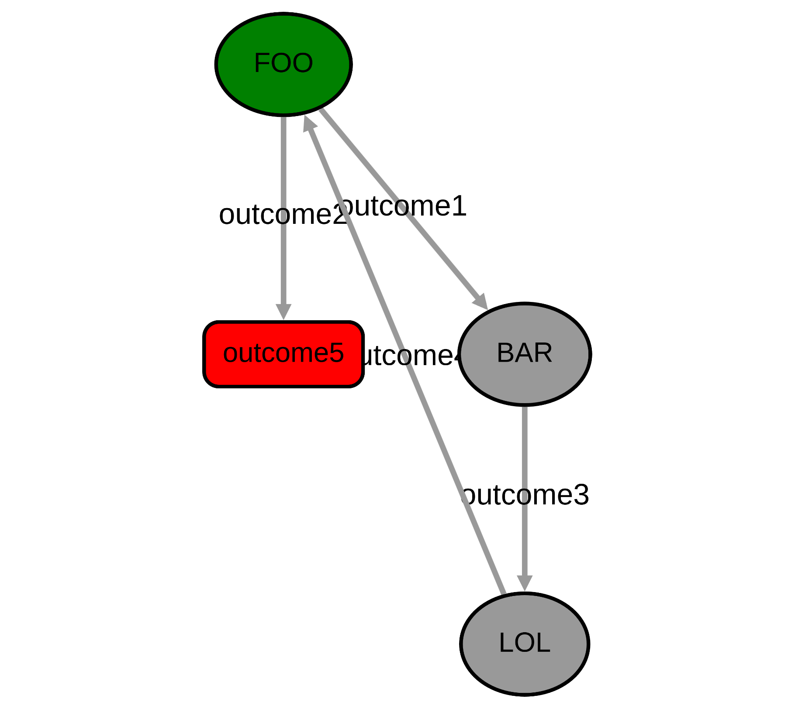
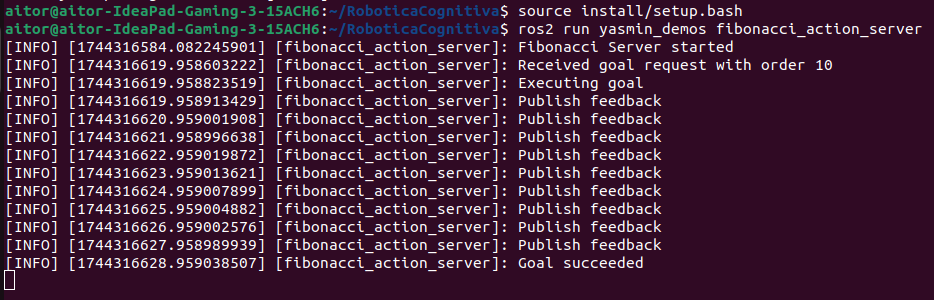
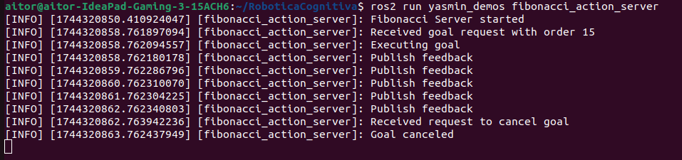

# Práctica: Sistemas reactivos

1. [Análisis de ejemplo básico](#1-análisis-del-ejemplo-básico)
2. [Extensión del ejemplo básico](#2-extensión-del-ejemplo-básico)
3. [Concepto Blackboard en YASMIN](#3-concepto-blackboard-en-yasmin)
4. [Integración de FSM con servicios en ROS 2](#4-integración-de-fsm-con-servicios-en-ros-2)
5. [Integración de FSM con acciones en ROS 2](#5-integración-de-fsm-con-acciones-en-ros-2)
6. [Integración de máquinas de estados finitas en ROSER](#6-integración-de-máquinas-de-estados-finitas-en-roser)

## 1. Análisis del ejemplo básico

Una vez hacemos el `colcon build` y el `source install/setup.bash`, en un terminal lanzamos la demo: `ros2 run yasmin_demos yasmin_demo.py` y en otro terminal el viewer de YASMIN: `ros2 run yasmin_viewer yasmin_viewer_node`. 
Cabe destacar que el enlance para ver la máquina de estados es: [Accede a la aplicación local](http://localhost:5000/)


En este ejemplo se ilustra el funcionamiento de una máquina de estados en YASMIN. Tenemos dos estados FooState y BarState, que se alternan ciclicamente hasta que se cumple una condición de salida.

Para entrar más en detalle, veamos el código que tenemos que documentar. 

Se definen las clases `FooState` y `BarState` que heredan de la clase `state` y se define en los métodos `execute` la lógica de transición de estados y el resultado. Por ejemplo, el Estado FooState la salida e indicador `outcome1`, nos retorna al estado `BAR` y el indicador `outcome2` nos muestra que el estado debe finalizar la ejecución y retornar `outcome4`. Para llegar al indicador `outcome2`, es necesario entrar dentro del método hasta en 3 ocasiones. La clase BAR, transita de nuevo al estado FOO, del mismo modo que en ele stado FOO, tenemos un *delay* de 3 segundos.

Una vez tenemos definicas las clases estado, debemos inicializar ROS 2, configurar el registro de logs e inicializar una máquina de estados. Una vez se inicializa la máquina de estados, se agregan los posibles estados con el método `add_state()` de la clase `StateMachine`. Publicamos la info de estados para la visualización de la máquina de estados y ejecutamos la misma.

Ejecución de yasmin_demo.py


## 2. Extensión del ejemplo básico

Para el correcto desarrollo de este apartado, se va a definir un estado adicional `LOL` que herede de la clase `state`. El objetivo de este nuevo estado, es transitar entre el estado BAR y el estado FOO, con este estado intermedio; de tal modo que se cumpla: FOO -> BAR -> LOL -> FOO.
<details>
  <summary>Haz clic para ver el código</summary>

```python
#!/usr/bin/env python3
import time
import rclpy

import yasmin
from yasmin import State
from yasmin import Blackboard
from yasmin import StateMachine
from yasmin_ros import set_ros_loggers
from yasmin_viewer import YasminViewerPub

# Define the FooState class, inheriting from the State class
class FooState(State):
    """
    Represents the Foo state in the state machine.

    Attributes:
        counter (int): Counter to track the number of executions of this state.
    """

    def __init__(self) -> None:
        """
        Initializes the FooState instance, setting up the outcomes.

        Outcomes:
            outcome1: Indicates the state should continue to the Bar state.
            outcome2: Indicates the state should finish execution and return.
        """
        super().__init__(["outcome1", "outcome2"])
        self.counter = 0

    def execute(self, blackboard: Blackboard) -> str:
        """
        Executes the logic for the Foo state.

        Args:
            blackboard (Blackboard): The shared data structure for states.

        Returns:
            str: The outcome of the execution, which can be "outcome1" or "outcome2".

        Raises:
            Exception: May raise exceptions related to state execution.
        """
        yasmin.YASMIN_LOG_INFO("Executing state FOO")
        time.sleep(3)  # Simulate work by sleeping

        if self.counter < 3:
            self.counter += 1
            blackboard["foo_str"] = f"Counter: {self.counter}"
            return "outcome1"
        else:
            return "outcome2"


# Define the BarState class, inheriting from the State class
class BarState(State):
    """
    Represents the Bar state in the state machine.
    """

    def __init__(self) -> None:
        """
        Initializes the BarState instance, setting up the outcome.

        Outcomes:
            outcome3: Indicates the state should transition back to the Foo state.
        """
        super().__init__(outcomes=["outcome3"])

    def execute(self, blackboard: Blackboard) -> str:
        """
        Executes the logic for the Bar state.

        Args:
            blackboard (Blackboard): The shared data structure for states.

        Returns:
            str: The outcome of the execution, which will always be "outcome3".

        Raises:
            Exception: May raise exceptions related to state execution.
        """
        yasmin.YASMIN_LOG_INFO("Executing state BAR")
        time.sleep(3)  # Simulate work by sleeping

        yasmin.YASMIN_LOG_INFO(blackboard["foo_str"])
        return "outcome3"

class LolState(State):
    """
    Represents the Lol state in the state machine.
    """

    def __init__(self) -> None:
        """
        Initializes the LolState instance, setting up the outcome.

        Outcomes:
            outcome4: Indicates the state should transition back to the Foo state.
        """
        super().__init__(outcomes=["outcome4"])

    def execute(self, blackboard: Blackboard) -> str:
        """
        Executes the logic for the Lol state.

        Args:
            blackboard (Blackboard): The shared data structure for states.

        Returns:
            str: The outcome of the execution, which will always be "outcome4".

        Raises:
            Exception: May raise exceptions related to state execution.
        """
        yasmin.YASMIN_LOG_INFO("Executing state LOL")
        time.sleep(1)  # Simulate work by sleeping

        yasmin.YASMIN_LOG_INFO(blackboard["foo_str"])
        return "outcome4"


# Main function to initialize and run the state machine
def main():
    """
    The main entry point of the application.

    Initializes the ROS 2 environment, sets up the state machine,
    and handles execution and termination.

    Raises:
        KeyboardInterrupt: If the execution is interrupted by the user.
    """
    yasmin.YASMIN_LOG_INFO("yasmin_demo")

    # Initialize ROS 2
    rclpy.init()

    # Set ROS 2 loggers
    set_ros_loggers()

    # Create a finite state machine (FSM)
    sm = StateMachine(outcomes=["outcome5"])

    # Add states to the FSM
    sm.add_state(
        "FOO",
        FooState(),
        transitions={
            "outcome1": "BAR",
            "outcome2": "outcome5",
        },
    )
    sm.add_state(
        "BAR",
        BarState(),
        transitions={
            "outcome3": "LOL",
        },
    )
    sm.add_state(
        "LOL",
        LolState(),
        transitions={
            "outcome4": "FOO",
        },
    )

    # Publish FSM information for visualization
    YasminViewerPub("yasmin_demo", sm)

    # Execute the FSM
    try:
        outcome = sm()
        yasmin.YASMIN_LOG_INFO(outcome)
    except KeyboardInterrupt:
        if sm.is_running():
            sm.cancel_state()

    # Shutdown ROS 2 if it's running
    if rclpy.ok():
        rclpy.shutdown()


if __name__ == "__main__":
    main()
```
</details><br>

Ejemplo del funcionamiento tras la ejecución:




## 3. Concepto Blackboard en YASMIN

**Blackboard** en YASMIN es un mecanismo centralizado de almacenamiento de datos compartidos en los diferentes estados de la máquina ("memoria compartida"). Actua como un espacio de trabajo donde los estados pueden leer y escribir información necesaria para la toma de deciones y la coordinación entre procesos.

Los propósitos de Blackboard en YASMINE son:
- Comunicación entre estados: Diferentes estados pueden intercambiar información sin necesidad de conexiones directas, facilitando la modularidad.
- Almacenamiento de contexto: Se almacena el contexto de la ejecución, resultados o variables que son relevantes para el ciclo de vida de la máquina de estados.
- Facilitación del Desarrollo de Arquitecturas Cognitivas: Al centralizar la información, se simplifica la integración de módulos que representan percepciones, decisiones y acciones en sistemas cognitivos.

**Ventajas**
- Cada estado puede actuar de manera independiente, facilitando el mantenimiento y escalabilidad.
- La integración en la arquitectura cognitiva es sencilla.
- Nos permite agregar, modificar y eliminar información de manera dinámica.

**Desventajas**
- Si blackboard falla, puede afectar a toda la máquina de estados.
- Si no se gestionan correctamente, se pueden tener problemas de concurrencia.
- En sistemas grandes puede tener limitaciones y generar problemas de eficiencia.

## 4. Integración de FSM con servicios en ROS 2

Primero vamos a probar el ejemplo **Service Demo** ejecutando los comandos:

```bash
ros2 run yasmin_demos add_two_ints_server
```

```bash
ros2 run yasmin_demos service_client_demo.py
```


Cabe destacar que la ejecución es tan rápida que no tenemos tiempo para ver en `yamine_viewer` el flujo de la máquina de estados.

Veamos el funcionamiento de la máquina de estados finita (FSM) con **ROS 2 service Client**.

Por un lado, tenemos un servidor (provedor del servicio) de ROS2 que recibe dos enteros (a y b) en la petición y devuelve la suma (sum) en la respuesta. Registrando cada petición en un log. Además, el servidor se queda esperando peticiones indefinidamente con `rclcpp::spin(node)`. 

Por otro lado, tenemos el cliente (consumidor del servicio) que define como se usa el servicio y presenta una máquina de estados compleja para coordinar el flujo de ejecución del cliente de servicio. Cabe destacar que la gestión de los dato se realiza mediante la memoria compartida `blackboard` y poder así, ser compartida entre estados. Además, se manejan los posible errores.

El flujo del proceso consiste en iniciar el nodo `add_two_insts_server` mientras tenemos lanzado en otro terminal el servidor a la espera de peticiones. Cuando llega una petición, se registran los valores recibidos, se calcula la suma y se devulve un resultado al cliente que se mostrará por terminal. 

Si se modifica el ejemplo para hacer múltiples solicitudes y se alamcenen las respuestas en una variable interna, tenemos el siguiente código:

<details>
  <summary>Haz clic para ver el código</summary>

```python
#!/usr/bin/env python3

import rclpy
from example_interfaces.srv import AddTwoInts

import yasmin
from yasmin import CbState
from yasmin import Blackboard
from yasmin import StateMachine
from yasmin_ros import ServiceState
from yasmin_ros import set_ros_loggers
from yasmin_ros.basic_outcomes import SUCCEED, ABORT
from yasmin_viewer import YasminViewerPub


class AddTwoIntsState(ServiceState):
    """
    A state that calls the AddTwoInts service to add two integers.

    This class is a state in a finite state machine that sends a request
    to the AddTwoInts service, retrieves the response, and updates the
    blackboard with the result.

    Attributes:
        service_type (type): The service type being used (AddTwoInts).
        service_name (str): The name of the service.
        outcomes (list): The list of possible outcomes for this state.
    """

    def __init__(self) -> None:
        """
        Initializes the AddTwoIntsState.

        Calls the parent constructor with the specific service type,
        service name, request handler, outcomes, and response handler.
        """
        super().__init__(
            AddTwoInts,  # srv type
            "/add_two_ints",  # service name
            self.create_request_handler,  # cb to create the request
            ["outcome1"],  # outcomes. Includes (SUCCEED, ABORT)
            self.response_handler,  # cb to process the response
        )

    def create_request_handler(self, blackboard: Blackboard) -> AddTwoInts.Request:
        """
        Creates the service request from the blackboard data.

        Args:
            blackboard (Blackboard): The blackboard containing the input values.

        Returns:
            AddTwoInts.Request: The request object populated with values from the blackboard.
        """
        req = AddTwoInts.Request()
        req.a = blackboard["a"]
        req.b = blackboard["b"]
        return req

    def response_handler(
        self, blackboard: Blackboard, response: AddTwoInts.Response
    ) -> str:
        """
        Processes the response from the AddTwoInts service.

        Updates the blackboard with the sum result from the response.

        Args:
            blackboard (Blackboard): The blackboard to update with the sum.
            response (AddTwoInts.Response): The response from the service call.

        Returns:
            str: The outcome of the operation, which is "outcome1".
        """
        blackboard["sum"] = response.sum
        return "outcome1"


def set_ints(blackboard: Blackboard) -> str:
    # Configura múltiples pares de números
    requests = [
        (10, 5),
        (20, 30),
        (100, 200)
    ]
    
    if "requests" not in blackboard:
        blackboard["requests"] = requests
        blackboard["current_index"] = 0
        blackboard["sums"] = []

    # Obtiene el siguiente par de números
    index = blackboard["current_index"]
    if index < len(blackboard["requests"]):
        a, b = blackboard["requests"][index]
        blackboard["a"] = a
        blackboard["b"] = b
        return SUCCEED
    else:
        return ABORT

def store_result(blackboard: Blackboard) -> str:
    # Almacena el resultado y avanza al siguiente
    blackboard["sums"].append(blackboard["sum"])
    blackboard["current_index"] += 1
    return SUCCEED

def print_all_sums(blackboard: Blackboard) -> str:
    yasmin.YASMIN_LOG_INFO(f"All sums: {blackboard['sums']}")
    return SUCCEED


def main():
    """
    The main function to execute the finite state machine (FSM).

    This function initializes the ROS 2 environment, sets up logging,
    creates the FSM with defined states, and executes the FSM.

    Raises:
        KeyboardInterrupt: If the user interrupts the program.
    """
    yasmin.YASMIN_LOG_INFO("yasmin_service_client_demo")

    # Init ROS 2
    rclpy.init()

    # Set ROS 2 logs
    set_ros_loggers()

    # Create a FSM
    sm = StateMachine(outcomes=["outcome4"])

    # Add states
    sm.add_state(
        "SETTING_INTS",
        CbState([SUCCEED, ABORT], set_ints),
        transitions={
            SUCCEED: "ADD_TWO_INTS",
            ABORT: "PRINTING_ALL_SUMS"
        }
    )
    sm.add_state(
        "ADD_TWO_INTS",
        AddTwoIntsState(),
        transitions={"outcome1": "STORING_RESULT"}
    )
    sm.add_state(
        "STORING_RESULT",
        CbState([SUCCEED], store_result),
        transitions={SUCCEED: "SETTING_INTS"}
    )
    sm.add_state(
        "PRINTING_ALL_SUMS",
        CbState([SUCCEED], print_all_sums),
        transitions={SUCCEED: "outcome4"}
    )

    # Publish FSM info
    YasminViewerPub("YASMIN_SERVICE_CLIENT_DEMO", sm)

    # Execute FSM
    try:
        outcome = sm()
        yasmin.YASMIN_LOG_INFO(outcome)
    except KeyboardInterrupt:
        if sm.is_running():
            sm.cancel_state()

    # Shutdown ROS 2
    if rclpy.ok():
        rclpy.shutdown()


if __name__ == "__main__":
    main()
```
</details><br>

Este ejemplo se construye bajo la inspiración del código demo. Para este, se define una lista de pares de números a sumar, se almacena de forma acumulada los resultados y se establece un mecanismo de iteración sobre los pares de números. Además, se imprime finalmente la lista de los resultados.

Veamos los reultados de la terminal:


## 5. Integración de FSM con acciones en ROS 2

primero hacemos una prueba del ejemplo **Action Demo** ejecutando los comandos:

```bash
ros2 run yasmin_demos fibonacci_action_server
ros2 run yasmin_demos action_client_demo.py
```

Mostramos los resultados de la terminal:




Veamos el funcionamiento de la integración de una máquina de estados (FSM) con un **ROS 2 Action Client**.

Por un lado, tenemos el Action Server o Servidor de accione en ROS 2, que nos permite hacer solicitudes sobre el calculo de la secuencia de Fibonacci, proporcionar un feedback durante el cálculo y manejar la cancelación si es necesario. Para esto, tal y como podemos observar en el `fibonacci_action_server.cpp`, se define una clase `FinonacciActionServer` que hereda de `rclcpp::Node`, es decir, es un nodo de ROS 2. Se emplea la acción `example_interfaces::action::Fibonacci`, que ya está definido en ROS 2 como un ejemplo. Además, tenemos 3 callbacks a tener en cuenta: `handle_goal` decide si acepta o retaza el objetivo,`handle_cancel` decide si se calcela y `handle_accepted` ejecuta la tarea en un hilo aparte. En la función `execute`, se genera la secuencia de Fibonacci paso a paso y se publica un feedback y se revisa la comunicación con el cliente.

El action server va a ser el mismo para la modificación de código que efectuaremos posteriormente, al limitar la máquina de estados al cálculo de la serie de Fibonacci hasta un determinado umbral (threshold).

Cabe destacar y a diferencia del ejemplo anterior, con el ServerState, con un ActionState podemos tener un control asíncrono de la ejecución en timepo real. Por esta razón y tal como veremos posteriormente en el ejercicio 6, emplearemos una subclase de ActionState para poder monitorizar el estado de la navegación.

En la integración de la máquina de estados con acciones en ROS 2, podemos apreciar como se definen estados específicos que representan las diferentes fases del proceso: `CALLING_FIBONACCI` y `PRINTING_RESULT`. Cada estado tiene una transición configurada segun el resultadod e la acción: SUCCEED, CANCEL, ABORT, que determinan el siguiente estado a ejecutar. La subclase `FibonacciState` hereda de la clase base `ActionState` para crear un estado que maneje la comunicación con sel servidor permitiendo enviar el objetivo, obtener información de feedback y manejar el resultado. Para esto, se definen los métodos `create_goal_handler`, `response_handler` y `print_feedback`.

El primer estado que lanza la máquina de estados es el de `CALLING_FIBONACCI` que envia el objetivo al action server y espera a las diferentes salidad. En función de la salida recibida (succeed, canceled u abort), la máquina de estados realiza la transicción als iguientee stado configurado. Por ejemplo, si la acción se completa con éxito, la máquina transita al estado `PRINTING_RESULT`, donde se procesa y se muestra el resultado final.

Se modifica el ejemplo para que el cliente supervise el progreso de la acción y detenga la ajecución si la secuencia de Fibonacci supera un umbral determinado.

<details>
  <summary>Haz clic para ver el código</summary>
  
```python
#!/usr/bin/env python3

import rclpy
from example_interfaces.action import Fibonacci

import yasmin
from yasmin import CbState, Blackboard, StateMachine
from yasmin_ros import ActionState
from yasmin_ros import set_ros_loggers
from yasmin_ros.basic_outcomes import SUCCEED, ABORT, CANCEL
from yasmin_viewer import YasminViewerPub


class FibonacciState(ActionState):
    """
    Class representing the state of the Fibonacci action.

    Inherits from ActionState and implements methods to handle the
    Fibonacci action in a finite state machine.

    Attributes:
        None
    """

    def __init__(self, threshold) -> None:
        """
        Initializes the FibonacciState.

        Sets up the action type and the action name for the Fibonacci
        action. Initializes goal, response handler, and feedback
        processing callbacks.

        Parameters:
            None

        Returns:
            None
        """
        super().__init__(
            Fibonacci,  # action type
            "/fibonacci",  # action name
            self.create_goal_handler,  # callback to create the goal
            None,  # outcomes. Includes (SUCCEED, ABORT, CANCEL)
            self.response_handler,  # callback to process the response
            self.monitor_feedback,  # callback to process the feedback
        )
        self.threshold = threshold  # Set the threshold for the Fibonacci sequence

    def create_goal_handler(self, blackboard: Blackboard) -> Fibonacci.Goal:
        """
        Creates the goal for the Fibonacci action.

        This method retrieves the input value from the blackboard and
        populates the Fibonacci goal.

        Parameters:
            blackboard (Blackboard): The blackboard containing the state
            information.

        Returns:
            Fibonacci.Goal: The populated goal object for the Fibonacci action.

        Raises:
            KeyError: If the expected key is not present in the blackboard.
        """
        goal = Fibonacci.Goal()
        goal.order = blackboard["n"]  # Retrieve the input value 'n' from the blackboard
        return goal

    def response_handler(self, blackboard: Blackboard, response: Fibonacci.Result) -> str:
        """
        Handles the response from the Fibonacci action.

        This method processes the result of the Fibonacci action and
        stores it in the blackboard.

        Parameters:
            blackboard (Blackboard): The blackboard to store the result.
            response (Fibonacci.Result): The result object from the Fibonacci action.

        Returns:
            str: Outcome of the operation, typically SUCCEED.

        Raises:
            None
        """
        blackboard["fibo_res"] = (
            response.sequence
        )  # Store the result sequence in the blackboard
        return SUCCEED

    def monitor_feedback(
        self, blackboard: Blackboard, feedback: Fibonacci.Feedback
    ) -> None:
        """
        Prints feedback from the Fibonacci action.

        This method logs the partial sequence received during the action.

        Parameters:
            blackboard (Blackboard): The blackboard (not used in this method).
            feedback (Fibonacci.Feedback): The feedback object from the Fibonacci action.

        Returns:
            None

        Raises:
            None
        """
        for num in feedback.sequence:
            if num >= self.threshold:
                yasmin.YASMIN_LOG_INFO(f"¡Umbral superado ({self.threshold})! Cancelando...")
                self.cancel_state()  
                return
            
        yasmin.YASMIN_LOG_INFO(f"Feedback: {list(feedback.sequence)}")
    

def main():
    """
    Main function to execute the ROS 2 action client demo.

    This function initializes the ROS 2 client, sets up the finite state
    machine, adds the states, and starts the action processing.

    Parameters:
        None

    Returns:
        None

    Raises:
        KeyboardInterrupt: If the user interrupts the execution.
    """
    yasmin.YASMIN_LOG_INFO("yasmin_action_client_demo_new")

    # Initialize ROS 2
    rclpy.init()

    # Set up ROS 2 logs
    set_ros_loggers()

    # Create a finite state machine (FSM)
    sm = StateMachine(outcomes=["terminado"])

    # Add states to the FSM
    sm.add_state(
        "CALLING_FIBONACCI",
        FibonacciState(threshold=6), 
        transitions={
            SUCCEED: "MOSTRAR_RESULTADO",
            CANCEL: "UMBRAL_SUPERADO",
            ABORT: "terminado",
        },
    )
    sm.add_state(
        "MOSTRAR_RESULTADO",
        CbState([SUCCEED], lambda b: print(f"Resultado final: {b['fibo_res']}")),
        transitions={SUCCEED: "terminado"}
    )
    sm.add_state(
    "UMBRAL_SUPERADO",
    CbState(
        [SUCCEED],
        lambda b: SUCCEED if (print("¡Secuencia detenida!") is None) else None
    ),
    transitions={SUCCEED: "terminado"}
)

    # Publish FSM information
    YasminViewerPub("YASMIN_ACTION_CLIENT_DEMO_NEW", sm)

    # Create an initial blackboard with the input value
    blackboard = Blackboard()
    blackboard["n"] = 15  # Set the Fibonacci order to 10

    # Execute the FSM
    try:
        outcome = sm(blackboard)
        yasmin.YASMIN_LOG_INFO(f"Resultado: {outcome}")
    except KeyboardInterrupt:
        if sm.is_running():
            sm.cancel_state()  # Cancel the state if interrupted

    # Shutdown ROS 2
    if rclpy.ok():
        rclpy.shutdown()


if __name__ == "__main__":
    main()
```
</details><br>

En esta modificación, se introduce una lógica adicional para cancelar la ejecución de la acción de Fibonacci cuando se supera un umbral definido.




## 6. Integración de máquinas de estados finitas en ROSER

En este ejercicio, se modifica la práctica de ROSER (robot navegando entre waypoints) para que la transicción entre posiciones se gestione mediante una máquina de estados finita.

Para lanzar este proyecto debemos ejecutar en 3 terminales diferentes lo siguientes comands:

```bash
# Primera terminal
cd turtlebot3_ws
colcon build
source /opt/ros/humble/setup.bash
source install/setup.bash
export TURTLEBOT3_MODEL=waffle
ros2 launch turtlebot3 simulation.launch.py

# Segunda terminal
cd RoboticaCognitiva/
colcon build
source install/setup.bash
ros2 run yasmin_demos final_proyect.py

# Tercera terminal
cd RoboticaCognitiva/
colcon build
source install/setup.bash
ros2 run yasmin_viewer yasmin_viewer_node
```

<details>
  <summary>Haz clic para ver el código</summary>

```python
#!/usr/bin/env python3

import yaml
import math
import rclpy
import random
import threading
import subprocess
import speech_recognition as sr
import yasmin 
from yasmin_viewer import YasminViewerPub
from yasmin import Blackboard, StateMachine, State, CbState
from yasmin_ros import ActionState
from nav2_msgs.action import NavigateToPose
from geometry_msgs.msg import Pose

# Resultados de estados
SUCCEED = "succeeded"
ABORT = "aborted"
CONTINUE = "continue"
STOP = "stop"

class ReadWaypointsState(State):
    def __init__(self):
        super().__init__(outcomes=[SUCCEED, ABORT])

    def execute(self, blackboard: Blackboard) -> str:
        try:
            with open(blackboard["yaml_path"], 'r') as file:
                data = yaml.safe_load(file)
                waypoints_list = data.get("waypoints", [])
                
                blackboard["waypoints"] = {
                    f"wp{i}": self.create_pose(wp) 
                    for i, wp in enumerate(waypoints_list)
                }
                
                yasmin.YASMIN_LOG_INFO("Waypoints disponibles:")
                for name, pose in blackboard["waypoints"].items():
                    yasmin.YASMIN_LOG_INFO(f"- {name}: ({pose.position.x}, {pose.position.y})")
                
                return SUCCEED
        
        except Exception as e:
            yasmin.YASMIN_LOG_INFO(f"Error: {str(e)}")
            return ABORT
        
    def create_pose(self, wp):
        pose = Pose()
        pose.position.x = wp["x"]
        pose.position.y = wp["y"]
        theta = wp["theta"]
        pose.orientation.z = math.sin(theta / 2)
        pose.orientation.w = math.cos(theta / 2)
        return pose

class Nav2State(ActionState):
    def __init__(self):
        super().__init__(
            NavigateToPose,
            "/navigate_to_pose",
            self.create_goal_handler,
            outcomes=["succeeded", "aborted", "canceled"]
        )

    def create_goal_handler(self, blackboard: Blackboard) -> NavigateToPose.Goal:
        goal = NavigateToPose.Goal()
        goal.pose.pose = blackboard["current_pose"]
        goal.pose.header.frame_id = "map"
        return goal
    
    
class FinalAnnouncementState(State):
    def __init__(self):
        super().__init__(outcomes=[SUCCEED])
        
    def execute(self, blackboard: Blackboard) -> str:
        synthesize_speech("Se ha completado la navegación")
        return SUCCEED


class VoiceControlState(State):
    def __init__(self):
        super().__init__(["continue", "stop"])
        
    def execute(self, blackboard: Blackboard) -> str:
        synthesize_speech("¿Continuar navegación o detener?")
        
        self.command = ""
        def get_command():
            self.command = recognize_command()
            
        thread = threading.Thread(target=get_command)
        thread.start()
        thread.join(timeout=10)
        
        yasmin.YASMIN_LOG_INFO(f"[DEBUG] Comando procesado: '{self.command}'")
        return "stop" if "detener" in self.command else "continue"

def synthesize_speech(text):
    subprocess.call(['espeak', '-v', 'es', text])

def recognize_command():
    recognizer = sr.Recognizer()
    with sr.Microphone() as source:
        yasmin.YASMIN_LOG_INFO("\n[DEBUG] Escuchando... (di algo ahora)")
        try:
            audio = recognizer.listen(source, timeout=5)
        except sr.WaitTimeoutError:
            yasmin.YASMIN_LOG_INFO("[DEBUG] Tiempo de espera agotado")
            return ""
            
    try:
        command = recognizer.recognize_google(audio, language='es-ES').lower()
        yasmin.YASMIN_LOG_INFO(f"[DEBUG] Comando reconocido: '{command}'")
        return command
    except sr.UnknownValueError:
        yasmin.YASMIN_LOG_INFO("[DEBUG] No se entendió el audio")
        return ""
    except Exception as e:
        yasmin.YASMIN_LOG_INFO(f"[DEBUG] Error en reconocimiento: {str(e)}")
        return ""

def get_next_pose(blackboard: Blackboard) -> str:
    try:
        if not blackboard["random_waypoints"]:
            return "completed"
            
        next_wp = blackboard["random_waypoints"].pop(0)
        blackboard["current_pose"] = blackboard["waypoints"][next_wp]
        yasmin.YASMIN_LOG_INFO(f"\nNavegando a: {next_wp}")
        return SUCCEED
        
    except Exception as e:
        yasmin.YASMIN_LOG_INFO(f"Error obteniendo waypoint: {str(e)}")
        return ABORT 
    
def take_random_waypoint(blackboard: Blackboard) -> str:
    blackboard["random_waypoints"] = random.sample(
        list(blackboard["waypoints"].keys()), 
        blackboard["waypoints_num"]
    )
    yasmin.YASMIN_LOG_INFO(f"\nRuta aleatoria seleccionada: {', '.join(blackboard['random_waypoints'])}")
    return SUCCEED

def create_nav_fsm():
    nav_sm = StateMachine(outcomes=[SUCCEED, ABORT])
    
    nav_sm.add_state(
        "GET_NEXT_POSE",
        CbState([SUCCEED, "completed", ABORT], get_next_pose), 
        transitions={
            SUCCEED: "NAVIGATE",
            "completed": "FINAL_ANNOUNCEMENT",
            ABORT: ABORT 
        }
    )
    
    nav_sm.add_state(
        "FINAL_ANNOUNCEMENT",
        FinalAnnouncementState(),
        transitions={SUCCEED: SUCCEED}
    )
    
    nav_sm.add_state(
        "NAVIGATE",
        Nav2State(),
        transitions={
            "succeeded": "VOICE_CHECK",  
            "aborted": ABORT,
            "canceled": ABORT,
        }
    )
    
    nav_sm.add_state(
        "VOICE_CHECK",
        VoiceControlState(),
        transitions={
            "continue": "GET_NEXT_POSE",  
            "stop": "FINAL_ANNOUNCEMENT"
        }
    )
    
    return nav_sm 

def main():
    
    yasmin.YASMIN_LOG_INFO("YASMIN_FINAL_PROYECT")
    
    rclpy.init()
    
    sm = StateMachine(outcomes=[SUCCEED, ABORT])
    
    sm.add_state(
        "LOAD_WAYPOINTS",
        ReadWaypointsState(),
        transitions={SUCCEED: "SELECT_WAYPOINTS", ABORT: ABORT}
    )
    
    sm.add_state(
        "SELECT_WAYPOINTS",
        CbState([SUCCEED], take_random_waypoint),
        transitions={SUCCEED: "NAVIGATION_LOOP"}
    )
    
    sm.add_state(
        "NAVIGATION_LOOP",
        create_nav_fsm(),
        transitions={SUCCEED: SUCCEED, ABORT: ABORT}
    )
    
    blackboard = Blackboard()
    blackboard["yaml_path"] = "/home/aitor/RoboticaCognitiva/src/yasmin/yasmin_demos/yasmin_demos/config_yaml/waypoints.yaml"
    blackboard["waypoints_num"] = 5  
    
    # Se publica la información de la máquina de estados para la visualización
    YasminViewerPub("YASMIN_FINAL_PROYECT", sm)
    
    try:
        outcome = sm(blackboard)
        synthesize_speech("Navegación completada" if outcome == SUCCEED else "Error en navegación")
    except KeyboardInterrupt:
        sm.cancel_state()
        synthesize_speech("Navegación cancelada")
    
    rclpy.shutdown()

if __name__ == "__main__":
    main()
```
</details><br>

El proceso de la máquina de estados se puede resumir en los siguientes pasos:

1.**Lectura de waypoints**: Se inicia el proceso con el estado `LOAD_WAYPOINTS`, que lee un archivo YAML para extraer la listade puntos de referencia (waypoints) y se convierten a poses. A su vez, se almacenan estos puntos en el "blackboard" para ser usados en estados posteriores.

2.**Selección aleatoria de waypoints que definen una ruta**: El estado `SELECT_WAYPOINTS` selecciona de forma aleatoria un número predefinido de waypoints con el objetivo de definir una ruta de navegación.

3.**Bucle de navegación**: Tenemos una máquina de estados interna denominada `NAVIGATOR_LOOP`, que opera de la siguiente manera:
- **Obtenemos el siguiente waypoint de la ruta**: El estado `GET_NEXT_POSE` extrae el siguiente waypoints de la ruta. Si no tenemos más puntos nos devulve un estado completado y salta al estado `FINAL_ANNOUNCEMENT`.
- **Navegación hacia la posición**: El estado `NAVIGATE` envía un objetivo de navegación empleando el sistema de navegación de ROS2. La clase que define este estado, hereda de un Action State. Se ha reutilizado la clase de `nav_demo.py`.
- **Control de la navegación por voz**: En este estado `VOICE_CHECK` se le solicita al usuario, mediante comando de voz, que indique si desea continuar o detener la navegación. Dependiendo de este comando de voz, el sistema decide si continua al siguiente waypoint o pasa al estado de ginalización.

- **Finalización**: Si se ha finalizado la ruta preestablecido o el usuario interrumpe la operación de navegación, se ejecuta el estado `FINAL_ANNOUNCEMENT` para declarar verbalmente que ha finalizado la navegación.

En yasmin viewer tenemos:


Para demostrar el funcionamiento, en el siguiente [LINK](https://drive.google.com/file/d/1pdqVaSeaXJfgozmAYOp9D68ZgWicDPIz/view?usp=sharing) podemos encontrar un video explicativo.